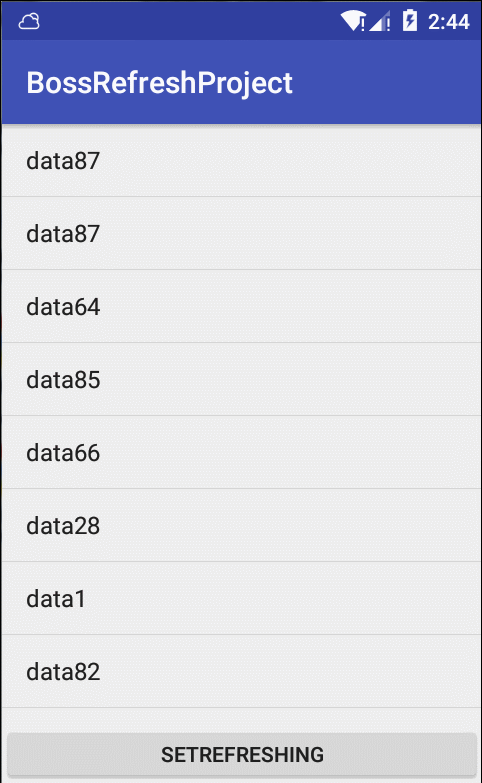

# BossRefreshProject
仿iosBoss直聘下拉刷新（minSdkVersion 14）



------

#### BossRefreshLayout

目前只支持ListView

```java
    <com.vice.bossrefreshlibrary.BossRefreshLayout
        android:id="@+id/boss_refresh"
        android:layout_width="match_parent"
        android:layout_height="400dp"
        custom:circleTopColor="@android:color/holo_blue_dark"//上边圆颜色
        custom:circleLeftColor="@android:color/holo_red_light"//左边圆颜色
        custom:circleBottomColor="@android:color/holo_green_light"//下边圆颜色
        custom:circleRightColor="@android:color/holo_orange_light"//右边圆颜色
        custom:backgroundColor="@android:color/transparent"//刷新体背景颜色
        custom:circleRadius="5"//圆圈的半径(dp)
        custom:centerY="20"//4个圈的中心点位置(centerX默认在中心，dp)
        custom:distance="5"//圆圈之间的最短距离的1/2（dp）
        custom:refreshHeight="50"> //刷新体的高度（dp）
        <ListView
            android:id="@+id/lv"
            android:layout_width="match_parent"
            android:layout_height="match_parent"></ListView>
    </com.vice.bossrefreshlibrary.BossRefreshLayout>
```

------

#### BossRefresh

刷新体（圆圈部分）部分，可以单独拿出来使用，传入百分比可以相应做变化

0~1/3：上圆从透明到实心的变化

1/3~1：从无到画完整个刷新体

```java
/**拖拽状态**/
refresh.setCurrentState(BossRefresh.STATE_DRAG);
refresh.setPercent(percent);
```

```java
/**刷新状态**/
refresh.setCurrentState(BossRefresh.STATE_REFRESHING);
refresh.setPercent(1.0f);
```

```java
/**重置为空闲状态**/
public void reset();
```


